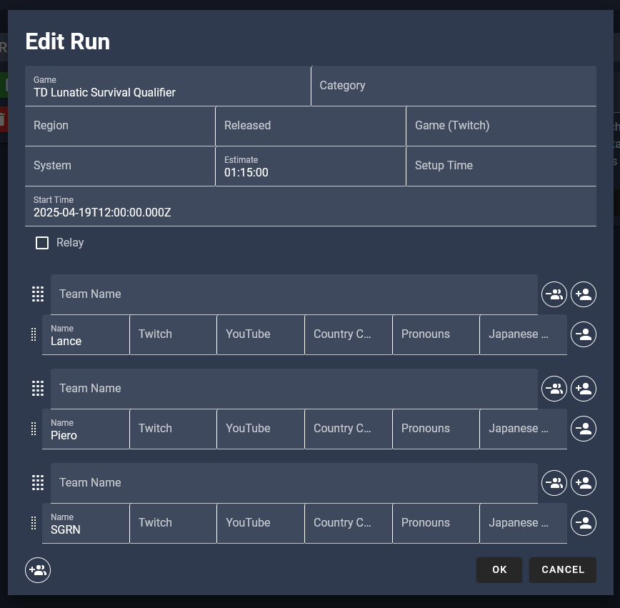

# NodeCG Setup

You will need [Node.js](https://nodejs.org) (20.x LTS tested) and [git](https://git-scm.com/) installed.

- `npm install -g nodecg` to install NodeCG's CLI
- `mkdir twc-2025-nodecg`
- `cd twc-2025-nodecg`
- `nodecg setup`
- `nodecg install speedcontrol/nodecg-speedcontrol`
- `cd bundles`
- `git clone https://github.com/touhouworldcup/twc-2025`
- `cd twc-2025`
- `npm install && npm run build` 

## Configuration

After installation, configure NodeCG, the bundle, and Speedcontrol:

`cfg/nodecg.json`:
```
{
  "port": 9999,
  "baseURL": "YOUR_DEPLOYMENT_URL",
  "login": {
    "enabled": true,
    "sessionSecret": "KEYSMASH_HERE",
    "local": {
      "enabled": true,
      "allowedUsers": [
        {
          "username": "USERNAME",
          "password": "PASSWORD"
        }
      ]
    }
  }
}
```
Pick a strong username/password or enable a different authentification method.

`cfg/twc-2025.json`:
```
{
  "nocodb": {
    "token": "NOCODB_ACCESS_TOKEN",
    "hourOffset": 2,
    "scheduleView": ["noco", "p6yw955ois6cyr7", "mgevku9hk8kqzfg", "vwlg67jsuxl5ds6s"],
    "playersView": ["noco", "p6yw955ois6cyr7", "mnzwmj0pin2x9ca", "vw7a8zow1z4csop6"]
  },
  "obs-websocket-password": "INSERT_RANDOM_LONG_STRING"
}
```
Get a NocoDB access token from https://app.nocodb.com/#/account/tokens  
Get scheduleView and playersView from the NocoDB "API Snippets"


`cfg/nodecg-speedcontrol.json`:
```
{
  "customData": {
    "run": [
      {
        "name": "Start Time",
        "key": "startTime",
        "ignoreMarkdown": true
      },
      {
        "name": "Artwork File",
        "key": "artworkFile",
        "ignoreMarkdown": true
      },
      {
        "name": "Artwork Credit",
        "key": "artworkCredit",
        "ignoreMarkdown": true
      }
    ],
    "player": [
      {
        "name": "Japanese Name",
        "key": "nameJP"
      }
    ]
  }
}
```

If you wish to add automatic title updates, see the [NodeCG Configuration](https://github.com/speedcontrol/nodecg-speedcontrol/blob/master/READMES/Configuration.md), specifically the "twitch" configuration.

You will likely want to run the NodeCG instance behind SSL using a reverse proxy, this is outside the scope of this README.

Run NodeCG in the main folder with `node .`

## Adding matches to speedcontrol

To add a TWC compatible match in speedcontrol:
- Set the game name to the `<GAME> <CATEGORY>` format. For example, "TD Lunatic Survival"
- Add the reset time as the estimate, for example "1:15:00" for 75 minutes reset time
- Set the "Start Time" custom field to a Date.parse() compatible string, for example "2025-04-19T12:00:00.000Z"
- Add each player on their own seperate team, and optionally add the Japanese Name custom field.


